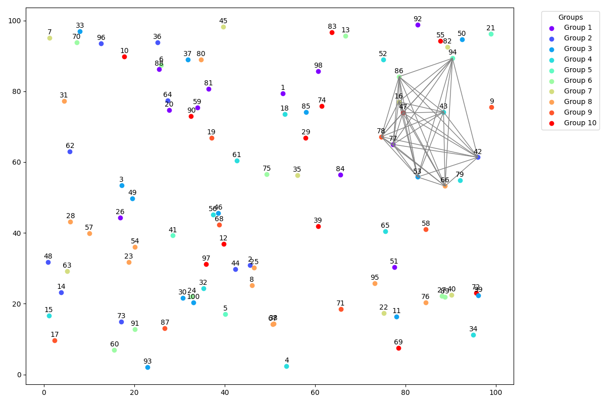

# pyo-select-points
Various Pyomo models to solve point related problems.

## Select points

Based on this blog post: [Select points](https://sysid.github.io/select-points/).

Pyomo model to solve the following problem:

> Given multiple sets of data points. Select one point per set so that the distances between the points is minimal.[^1]

## Maximum number of points with minimum distance

> Given N points and a Minimum Distance D, find the maximum number of points that can be selected such that the distance
> between any two points is at least D.[^2]

[^1]: http://yetanothermathprogrammingconsultant.blogspot.com/2022/10/select-points.html

[^2]: http://yetanothermathprogrammingconsultant.blogspot.com/2022/12/maximum-number-of-points-with-minimum.html
